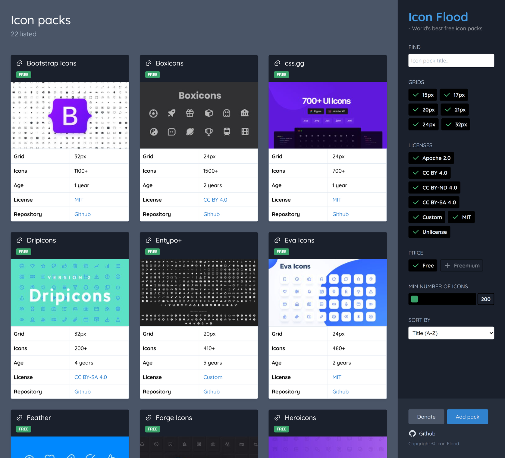

# IconFlood

## World's best free icon packs

If you are searching for great quality SVG icons for the web, you are at the
right place. It's not the largest collection, but it's the best of the best.

https://iconflood.csspost.com/

## Requirements

To be included on the site, all the requirements below needs to be fulfilled.

- High quality icons.
- At least 200 icons.
- SVG support.
- Good preview page.
- Free for personal and commercial use.
- General icons, not a specific niche.
- Black and white.

## Add a new icon pack

Make sure the icon pack you want to suggest matches the above requirements.

[Add an issue](https://github.com/jenstornell/iconflood/issues)

## New icon packs, not yet added

- https://github.com/afnizarnur/nataicons
- https://github.com/zraly/humbleicons
- https://github.com/Richard9394/MingCute
- https://iconsax.io/
- https://www.majesticons.com/
- https://www.bypeople.com/minimal-free-pixel-perfect-icons/
- https://keyicons.com/
- http://ikons.piotrkwiatkowski.co.uk/
- https://coolicons.cool/
- https://iconoir.com/
- https://akaricons.com/
- https://polaris.shopify.com/icons
- https://faicons.dev/
- https://icons.mono.company/
- https://iconsvg.xyz/
- https://www.visiwig.com/icons/
- https://basicons.xyz/
- http://rivolicons.hadrien.co/free/
- https://licons.xyz/
- https://carbondesignsystem.com/guidelines/icons/library/
- https://circumicons.com/
- https://lucide.dev/
- https://hicon.me/
- https://github.com/coreui/coreui-icons
- https://pangolicons.herokuapp.com/
- https://clarity.design/icons
- https://iconoir.com/
- https://github.com/microsoft/fluentui-system-icons
- https://basicons.xyz/
- https://iconhub.io/
